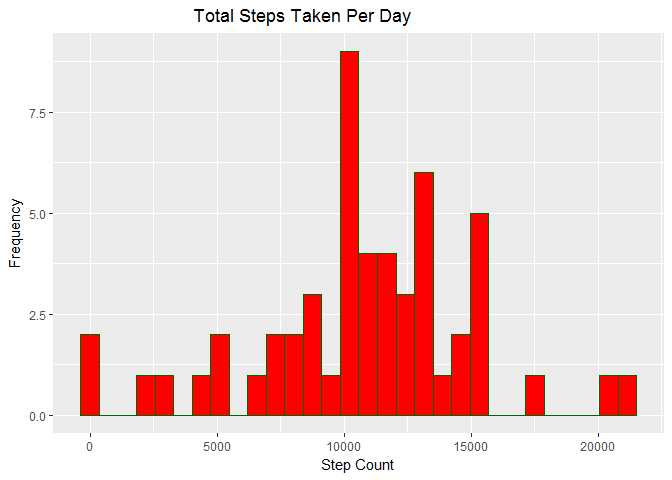
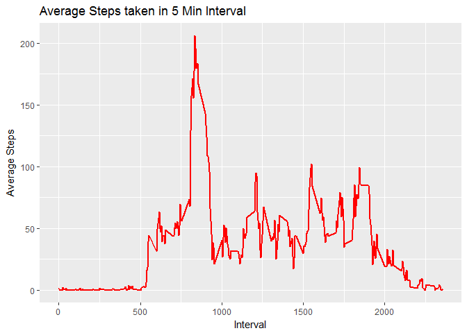
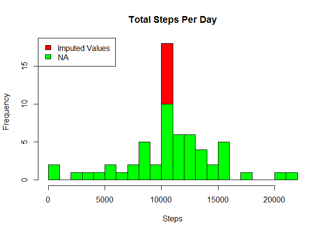
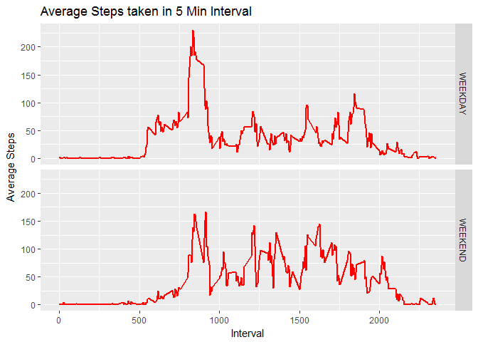

Introduction
------------

It is now possible to collect a large amount of data about personal
movement using activity monitoring devices such as a Fitbit, Nike
Fuelband, or Jawbone Up. These type of devices are part of the
"quantified self" movement - a group of enthusiasts who take
measurements about themselves regularly to improve their health, to find
patterns in their behavior, or because they are tech geeks. But these
data remain under-utilized both because the raw data are hard to obtain
and there is a lack of statistical methods and software for processing
and interpreting the data.

This assignment makes use of data from a personal activity monitoring
device. This device collects data at 5 minute intervals through out the
day. The data consists of two months of data from an anonymous
individual collected during the months of October and November, 2012 and
include the number of steps taken in 5 minute intervals each day.

Load Required Libraries
-----------------------

    require(dplyr)
    require(ggplot2)
    require(lubridate)

Read the required data set for analysis and examine summary
-----------------------------------------------------------

    activity<-read.csv("activity.csv")
    activity$date<-as.Date(activity$date)
    summary(activity)

    ##      steps             date               interval     
    ##  Min.   :  0.00   Min.   :2012-10-01   Min.   :   0.0  
    ##  1st Qu.:  0.00   1st Qu.:2012-10-16   1st Qu.: 588.8  
    ##  Median :  0.00   Median :2012-10-31   Median :1177.5  
    ##  Mean   : 37.38   Mean   :2012-10-31   Mean   :1177.5  
    ##  3rd Qu.: 12.00   3rd Qu.:2012-11-15   3rd Qu.:1766.2  
    ##  Max.   :806.00   Max.   :2012-11-30   Max.   :2355.0  
    ##  NA's   :2304

Calculate mean total number of steps taken per day
--------------------------------------------------

    tot_steps_per_day<-activity %>% group_by(date) %>% summarize(total_steps=sum(steps))

Plot a histogram of the total number of steps taken each day and
calculate mean and median of steps taken per day

    step_plot<-ggplot(tot_steps_per_day,aes(total_steps)) + 
            geom_histogram(colour = "darkgreen",fill="red") + 
            ggtitle("                            Total Steps Taken Per Day") +
            xlab("Step Count")+
            ylab("Frequency")
    step_plot

    ## `stat_bin()` using `bins = 30`. Pick better value with `binwidth`.

    ## Warning: Removed 8 rows containing non-finite values (stat_bin).

    mean(tot_steps_per_day$total_steps,na.rm=TRUE)

    ## [1] 10766.19

    median(tot_steps_per_day$total_steps,na.rm=TRUE)

    ## [1] 10765

Calculate average daily activity pattern
----------------------------------------

    average_5min<-activity %>% group_by(interval) %>% summarize(mean_interval_steps=mean(steps,na.rm=TRUE))
    plot_interval_steps<-ggplot(average_5min,aes(interval,mean_interval_steps)) + geom_line( colour="red",size=1) +
                            ggtitle("Average Steps taken in 5 Min Interval") + xlab("Interval") +ylab("Average Steps")
    plot_interval_steps

On average across all the days in the dataset, the following 5 minute
interval contains the maximum number of steps

    max_steps<-average_5min[average_5min$mean_interval_steps==max(average_5min$mean_interval_steps),]
    max_steps$interval

    ## [1] 835

Impute Missing Values
---------------------

    #Calculate Total number of missing values
    missing_values<-nrow(activity[is.na(activity$steps),])
    missing_values

    ## [1] 2304

    st_indices<-which(is.na(activity$steps))
    activity2<-activity

    #Impute Missing Data using mean for that 5-minute interval
    activity2[st_indices,]$steps<-sapply(activity2[st_indices,]$interval,
                                        function(x){
                                                    ceiling(average_5min[average_5min$interval==x,]$mean_interval_steps)
                                                }
                                        )
    #Calculate the total amount of steps taken per day after imputing
    tot_steps_per_day2<-activity2 %>% group_by(date) %>% summarize(total_steps=sum(steps))

Plot histogram of the total number of steps taken each day after
imputing

     #Overlay 2 Historgrams (one with NAs and the other with filled in Data)
    hist(tot_steps_per_day2$total_steps, breaks = 30, col = "red", xlab = "Steps", main = "Total Steps Per Day")
    hist(tot_steps_per_day$total_steps, breaks = 30, col = "green", xlab = "Steps", main = "Total Steps Per Day", add=T) 
    legend("topleft", c("Imputed Values ", "NA"), fill = c("red","green"))

After calculating mean and median on the imputed data, it is observed
that mean almost remains the same, but median was increased.

    #Calculate Mean and Median of steps taken per day
    mean(tot_steps_per_day2$total_steps,na.rm=TRUE)

    ## [1] 10784.92

    median(tot_steps_per_day2$total_steps,na.rm=TRUE)

    ## [1] 10909

Observe differences in activity patterns between weekdays and weekends
----------------------------------------------------------------------

    activity2$daytype=ifelse(wday(activity2$date) %in% c(2:6),"WEEKDAY","WEEKEND")
    activity2$daytype<-as.factor(activity2$daytype)

    # Calculate 5-minute intervals and the average number of steps taken, averaged across all weekday days or weekend days.
    average_5min_day<-activity2 %>% group_by(daytype,interval) %>% summarize(mean_interval_steps=mean(steps,na.rm=TRUE))
    plot_day<-ggplot(average_5min_day,aes(interval,mean_interval_steps)) + 
            facet_grid(daytype~.) +
            geom_line(colour="red",size=1) +
            ggtitle("Average Steps taken in 5 Min Interval") + xlab("Interval") +ylab("Average Steps")
    plot_day

